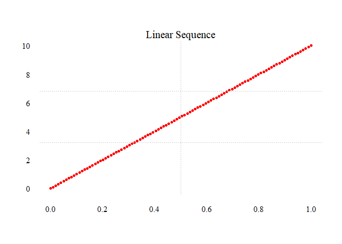

<!-- README.md is generated from README.Rmd. Please edit that file -->

# sequentially 

<!-- badges: start -->

 [](https://CRAN.R-project.org/package=sequentially)
[](https://github.com/mkenney/software-guides/blob/master/STABILITY-BADGES.md#work-in-progress)
[](https://app.codecov.io/gh/jpmonteagudo28/sequentially)

<!-- badges: end -->

This package is born out of curiosity rather than necessity.
`sequentially` creates non-linear and linear numeric sequences. By using
non-linear interpolation the user can animate their data in a way that
is more visually pleasing than uniform, linear interpolation. The
functions in this package represent a break from the **essential** but
*boring* `seq()` family of functions–I wanted to plot numeric sequences
that looked different and could be used in data visualization, motion
animation, frame interpolation, UI/UX design, population dynamics, or
other fields.

## Installation

You can install the development version of sequentially like so:

``` r
devtools::install_github("jpmonteagudo28/sequentially")
```

or download it from CRAN:

``` r
install.packages("sequentially")
```

## What you get:

This is a basic example which shows you how to solve a common problem:

``` r
library(sequentially)

# Linear sequence from 0 to 10
 t <- seq(0,1,length.out = 100)
 lin_seq <- seq_smooth(0, 10, n = 100, type = "linear")
 plot.new()
 plot.window(range(t),range(lin_seq))
 points(t,lin_seq,pch = 16, cex = .75,col = "red")
 axis(1,tcl = 0.75,lwd = 0, family = "serif")
 axis(2,lwd = 0, family = "serif", las = 1)
 grid(2,col = "gray80",lty = "dotted", lwd = 0.50)
 mtext("Linear Sequence",3,cex = 1.3, family = "serif")
```



``` r


 # Elastic easing out sequence
 elastic_seq <- seq_smooth(0, 10, n = 100, type = "elastic", ease = "out")
 plot.new()
 plot.window(range(t),range(elastic_seq))
 points(t,elastic_seq,pch = 16, cex = .75,col = "red")
 axis(1,tcl = 0.75,lwd = 0, family = "serif")
 axis(2,lwd = 0, family = "serif", las = 1)
 grid(2,col = "gray80",lty = "dotted", lwd = 0.50)
 mtext("Ease-out Elastic Sequence",3,cex = 1.3, family = "serif")
```


What is special about using `README.Rmd` instead of just `README.md`?
You can include R chunks like so:

You’ll still need to render `README.Rmd` regularly, to keep `README.md`
up-to-date. `devtools::build_readme()` is handy for this.

You can also embed plots, for example:

## Related Software

- [tweenr](https://cran.r-project.org/web/packages/tweenr/tweenr.pdf) -
  an R package dealing with data animation.
- [displease](https://github.com/coolbutuseless/displease) - a related
  package used as inspiration for this one.
- [ofpennereasing](https://github.com/jesusgollonet/ofpennereasing) -
  Rcpp files containing Robert Penner’s easing functions
